# Bitcoin Trading Agent - Project Workflow Diagram

## 🔄 **Main Trading Loop Workflow**

```mermaid
graph TD
    A[📱 Scheduler: Every 30 minutes] --> B[🔧 Main Trading Loop]
    B --> C[📊 Fetch Market Data]
    C --> D[💰 Load Configuration]
    D --> E[🧠 Strategy Manager]
    
    E --> F{Portfolio Risk Check}
    F -->|Risk > 25%| G[🚨 Risk Pause - Stop Trading]
    F -->|Risk OK| H[📈 Evaluate DCA Strategy]
    
    H --> I{DCA Should Buy?}
    I -->|Yes| J[💸 Execute DCA Buy]
    I -->|No| K[⏸️ DCA Hold]
    
    E --> L[🔄 Evaluate Swing Trading]
    L --> M{Hybrid Mode Enabled?}
    M -->|Yes| N{ML Forecast Positive?}
    M -->|No| O[🚫 Swing Disabled]
    
    N -->|Yes| P[🎯 Open Swing Position]
    N -->|No| Q[⏸️ Swing Hold]
    
    P --> R[📊 Monitor Active Trades]
    R --> S{Stop Loss Hit?}
    S -->|Yes| T[🛑 Close Swing Position]
    S -->|No| U[📈 Continue Monitoring]
    
    J --> V[💾 Update Portfolio]
    T --> V
    V --> W[📝 Log Trade]
    W --> X[📱 Send Notifications]
    X --> Y[⏰ Wait for Next Cycle]
```

## 🏗️ **System Architecture Components**

## 📊 **Data Flow Diagram**

## 🎯 **Strategy Decision Tree**

```mermaid
graph TD
    A[Current Market Data] --> B{Portfolio Risk > 25%?}
    B -->|Yes| C[🚨 PAUSE ALL TRADING]
    B -->|No| D[Continue Trading]
    
    D --> E{DCA Strategy}
    E --> F{Price Drop >= 3%?}
    F -->|Yes| G{Time Interval >= 24h?}
    G -->|Yes| H{Sufficient Budget?}
    H -->|Yes| I[✅ EXECUTE DCA BUY]
    H -->|No| J[❌ Insufficient Funds]
    G -->|No| K[⏰ Wait for Time]
    F -->|No| L[📈 Price Too High]
    
    D --> M{Swing Trading}
    M --> N{Hybrid Mode Enabled?}
    N -->|No| O[🚫 Swing Disabled]
    N -->|Yes| P{ML Forecast > 0?}
    P -->|Yes| Q{ATR Available?}
    Q -->|Yes| R[✅ OPEN SWING POSITION]
    Q -->|No| S[❌ No ATR Data]
    P -->|No| T[📉 Bearish Forecast]
    
    R --> U[Monitor Stop Loss]
    U --> V{Price <= Stop Loss?}
    V -->|Yes| W[🛑 CLOSE SWING POSITION]
    V -->|No| X[📊 Continue Monitoring]
```

## 🔄 **Backtesting Workflow**

## 📱 **Notification System**

## 🔧 **Configuration Management**

## 📊 **Key Metrics & Monitoring**

## 🚀 **Deployment & Execution**

---

## 📋 **Component Summary**

### **Core Trading Engine**
- **Strategy Manager**: Orchestrates DCA and swing trading decisions
- **DCA Strategy**: Dollar-cost averaging logic with configurable triggers
- **ML Forecasting**: ARIMA(1,1,2) model for price prediction
- **Threshold Adapter**: ML-driven parameter adjustment

### **Risk Management**
- **Portfolio Risk Check**: 25% drawdown protection
- **ATR-based Stops**: Dynamic stop-loss calculation
- **Position Sizing**: Configurable trade amounts

### **Data & Execution**
- **Price Data**: Coinbase API integration with ATR calculation
- **Paper Broker**: Simulated trading execution
- **Portfolio Tracking**: JSON-based state management

### **Monitoring & Notifications**
- **Telegram Bot**: Real-time trading alerts
- **Email Reports**: Daily/weekly summaries
- **Google Sheets**: Portfolio tracking

### **Testing & Validation**
- **Backtest Engine**: Historical strategy validation
- **Configuration Management**: Environment-based settings
- **Error Handling**: Graceful failure management

This workflow shows how the Bitcoin Trading Agent operates as a complete, automated system that continuously monitors the market, makes intelligent trading decisions, and manages risk while providing comprehensive monitoring and reporting capabilities.
